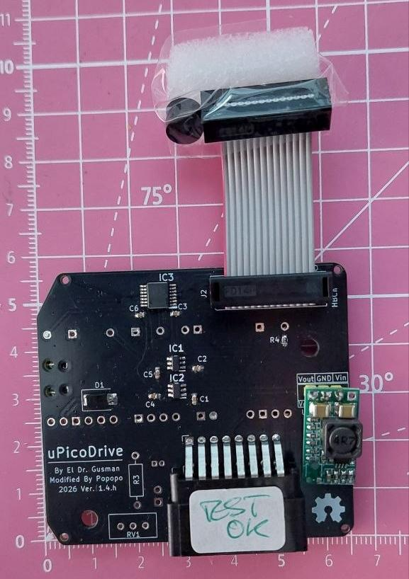
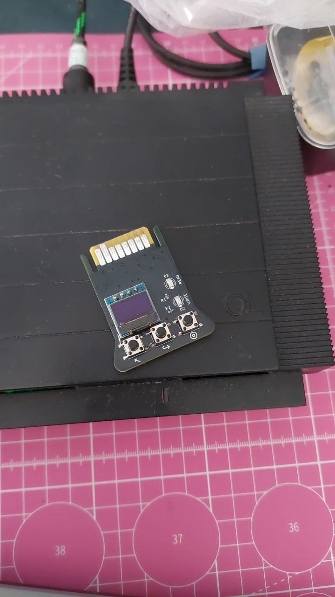

# Gerbers Description
 _Secction to describe each Gerber option_

---

UPDATE 12/08/2026

> [!NOTE]
> _New revisions of the driver (h) & cartridges (e) with extra EMI & electrical protection and improving signals._.

There system is compound by a driver and its cartridge. It is always possible to improve somehow some elements or factors, so an alive project requires time to time some new releases (when they are justified). 

Sometimes changes are to improve signals, ESD/EMI factors, or power. In other cases it is to bring to the users more options and better implementation/building.

## Driver
Always the last version will result in the best option, but sometimes those changes are not necesesary. If you don't know what to use, choose the newest version. If you are happy with lower protection level or not using some hardware elements you know won't be useful for you (that means you have a good control of what you are doing), choose the alternative from available Gerbers.

## Cartridge
Here is where a final user could feel confuse due to variety of options :) , let's see it in an direct & easy way.

**There are 2 main different shapes** for cartridge which main difference is the size of the handles: **Short** and **Large** one. 

The short is more than enough to handle it easily and fits into the old black plastic box where Sinclair used to give PSION software.

The large is easier to extract/insert than the short one, for hands like mine it is nicer. 

How it is designed allows you to use SMD Leds or TH Leds (giving more retro feeling). So when mounting the LEDs you can choose what suits the most to your personality. Keep in mind that schemas reflects resistos values for the LEDs acording to the specs of the LEDs I mount. TH versions may be happy with 1K resistors but always check it out by yourself according to luminance, max current and max current that RP2040 may source.

Finally, recently I have made some changes for cartridges in order to improve electrical manipulation, so a good part of the pads that were connection to the EDGE socket now are retreived in order to ensure Power Lines are connected before the signals. It is by now working great, but old version has been working for 3 years with non stop (and with HASL finishing).

**Pros**: Safer electrically case now power pads connect firstly (specially GDN), the EDGE contacts now scratch less copper/HASL surface when inserting/removing operation and now it goes on a FR4 fiber that is harder to scratch than regular pads.

**Cons**: Has not been tested for years like previous one.

If you are going to produce your own PCBs or use any maker like PCBWay or JLCPCB, you can choose a better finish for EDGE connector and PADs, like ENIG or HARD Gold. But be aware, IMHO that is not justified at all, is too expensive for the service of this system that have been working for years without any problem at innexpensive price. HASL is more than enough like all our machines have been produced (back ports on ZX, QL, MSX, CPC... long list). I recommend HASL: cheap & more than good for the service.

Trust me, you will more than happy with any option you choose. :)

Comparative Table

Dev | Rev | Release date | Tested? | Description |
| -- | ------ | :--: | :--: | ---- |
| Driver |  |  |  |  |
| | 1.4e | 2024 | Yes | Reshaped, re-routed |
| |  |  | Yes |  |
| Cartridge|  |  |  |  |
| |  |  | Yes |  |
| |  |  | Yes |  |
| | 1.4e.L |  | Yes | Edge reworked + 100nF added to mSD |
| | 1.5a.S |  | No | Edge reworked, re-routed, exchanged positions RW leds |
| | 1.5a.L |  | No | Same than S version |
| |  |  | No |  |