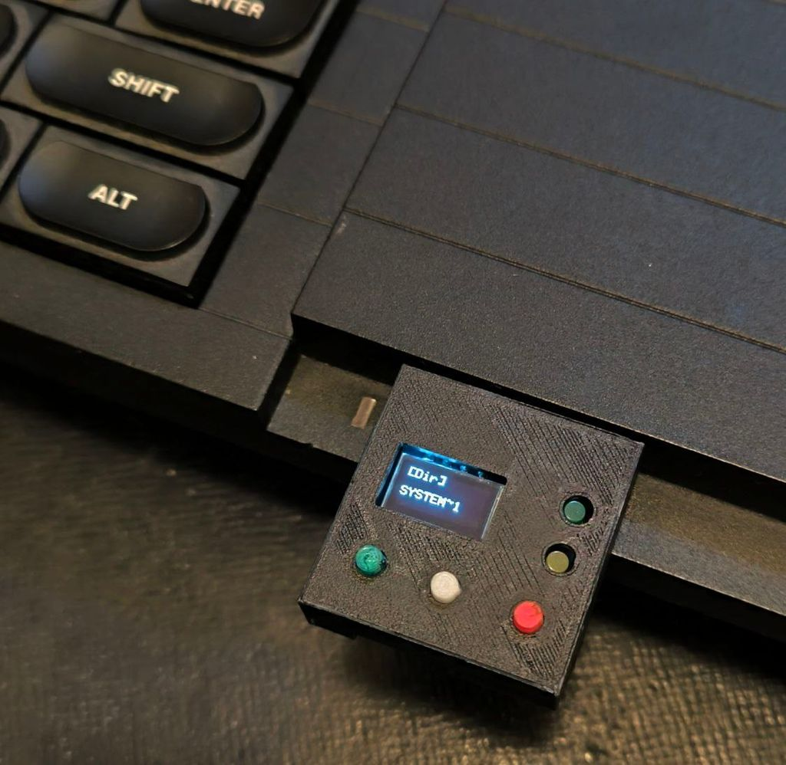
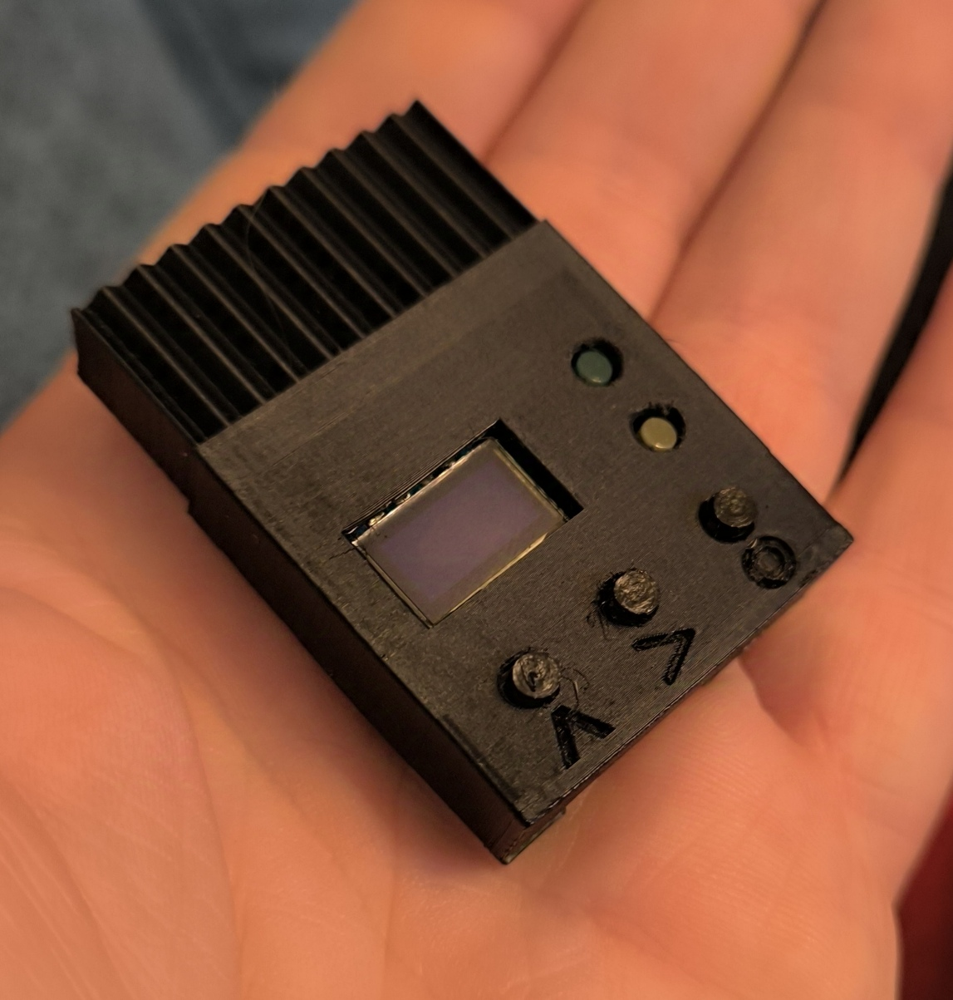

# MicroPicoDrive
 _An internal replacement for the Sinclair QL Microdrive_

---

UPDATE 12/08/2026

> [!NOTE]
> _New revisions of the driver & cartridges with extra EMI & electrical protection and improving signals. Firmware revision 0.14 improved & stable. Firmware & driver tested, tested last cartridge sub-version 'e' for 4 weeks. Added 3D case (STL) created by Jbizze for short cartridge version to its link_.

> [!TIP]
> All material (Gerbers, BOM, etc) & user guides at the bottom of the page.
---

This branch is for the new 1.4 version of the MicroPicoDrive.
This version was created by Silverio MRS (AKA Popopo) from [Dr. Gusman's original version](https://github.com/gusmanb/micropicodrive).

The image above shows the main driver unit and the 2 cartridges versions with long and short wings (_handles_). Long wings allows to manipulate the cartridge easily reducing mechanical pressure. Shorts instead gives an old fashion shape and allows to be stored into the old (used) black boxes of QL time. Also wearing the 3D case created by Jbizze for the short version cartridge.

---
The next link is a fast view with a demo of the device [Short video demo on Youtube](https://youtu.be/dqscsMP1UB8).

---
_Schema of the driver unit that goes inside the QL._

---
_Schema of the cartridge that host the microSD and interact with the user._

# Overview
The project was born to give a solution to the old [ZX Microdrive](https://en.wikipedia.org/wiki/ZX_Microdrive) data systems that relies on tape technology. Due to all those system are more than 50 years old and doesn't exist replacements. This system needed a modern replacement stable, very easy to use, flexible and cheap.

The solution presented relay on Hardware and Software combination. With an OpenSource philosophy that could be easily be continued by thirds parties if needed.

The OpenSource & OpenHardware philosophy also responds to the main idea of allowing everyone to built at any time with inexpensive materials, modify or implements different features.

# Objectives of the project
The project was born with the simple goal to be something that anyone could afford and built, what was exceed by far. Yet, there were some details that make the solution not so universal for everyone (_IMO_). Here is where our story begins.

The point is to exploit all the potential of the concept, increasing the number of features of the device, closer to the Gotek concept but powered up with a lot of amazing and desired features.

The first approach was a full success. Whatever in some design points it was limited:
1. It needs some skills and technical hardware acknowledged the system in advance before to build it.
2. Some users with visual difficulties found it unusable due to the small screen. 
3. If you want to distribute it, you can't without knowing previously where the final user want to place it.

Not only **the hardware have been re-shaped**, but **the code/firmware has been refactored, documented (even more) and modularized** in a way that the skills requirements to modify it, become affordable with lower programming skill than before.

It makes sense if the idea is to get chances of scalability and maintenance by the community or recycle the code/hardware in other similar projects.

## Changes over the original project
**New 1.4 design changes:**

+ Place it in any position (MDV_1 or MDV_2) without physical modification.
+ IDC Cable now go straight to the connector on the QL MB.
+ Removed Status LED from Cartridge due to redundancy information with QL Case LED.
+ Add MicroSD footprint to the Cartridge. From now on, it will be cheaper & elegant to build it up.
+ The board is shorter than original one reducing possible case clashes.
+ RaspBerryPi Pico now is soldered on the bottom of the Driver PCB.
+ The Power regulator has changed the place, allowing to the board be placed in any position (MDV_1 or MDV_2).
+ Solved problem with QL Speaker.
+ Solved problem with QL metal chassis under keyboard.
+ Solved problem with right lateral QL case and the regulator.
+ Sound System ready for sound emulation or new features related with it (Working in progress).
+ Added decoupling capacitors to make signals more stable for oLED & mSD.
+ Added schottky diode on the driver that allows program it without disconecting from the main QL PCB. For extra it gives extra protection.
+ Cartridges now has pads retraived for power lines and detection.

## What is coming (TODO functionalities)

Majority of users find the device functional and accomplish their expectations, however still it keeps some nice surprises to powering it up. **All of then can be activated optionally (_opt_)**.

 **Software/firmware**
- [x] Config file to customize preferences (opt).
- [x] New screen modes with bigger fonts (opt).
- [x] Capability of defining a default image to load when turning on the QL or inserting the cartridge (opt).
- [ ] Direct writing (optional).
- [ ] Direct control from the QL OS over the storage system (mSD).

 **Hardware**
- [ ] Sound emulation of the motor (WiP) (opt).
- [ ] MIDI player (WiP) (opt).
- [ ] Bluetooth cartridge and its APP to load images from other devices (PC, Phone, Tablet...) (opt).

### Some extra add-ons that could come
- [ ] External version of the MDP.
- [ ] Interface I MDP version.

---

# Audio visual material
The next videos were made in order to make easier to everyone the understanding about the integration and use on Sinclair QL systems. 
- [Presentation](https://youtu.be/yyiCoWN6E_A) of the project and its initial goals.
- [How to install it](https://youtu.be/CpoAiAcQRLA) points to keep in mind to not damage your Sinclair QL when installing the MDP into it.
- [User's Guide I](https://youtu.be/wyJjXfhqH4E) user's guide to change the firmware, prepare the SD, customize your preferences & browse it.
- [User's Guide II](https://youtu.be/AZIg0KIsFko) shows how to use the basis functions of the MDTools to create a new MDV image, also it shows the most common mistakes.

# Gerbers, Firmware & more 
To download and make the devices on your own using my design you can access to the Gerbers and Firmwares at the release section:
[Releases Gerbers & Firmware](https://github.com/Silveriomrs/micropicodrive/releases/tag/v1.4)

For detailed information about revisions of drivers or cartridges go to see: [Gerbers Descriptions Section](https://github.com/Silveriomrs/micropicodrive/tree/1.4/Hardware%201.4%20(By%20Popopo)/Gerbers)

For i/BOM check directory: [Schmems & i/BOMs](https://github.com/Silveriomrs/micropicodrive/tree/1.4/Hardware%201.4%20(By%20Popopo)/Schems%20&%20BOMs)

For 3D case created by Jbizze for short cartridge version: [STL from Thingverse](https://www.thingiverse.com/thing:6886864) or to Download directly: [Releases Gerbers & Firmware](https://github.com/Silveriomrs/micropicodrive/releases/tag/v1.4)

