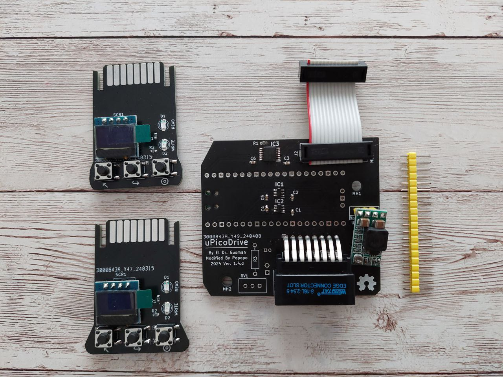

# MicroPicoDrive 
## _An internal replacement of the Sinclair QL Microdrive_

UPDATE 01/07/2024

> [!NOTE]
> _This Fork is updating the information_

This branch is for the new 1.4 version of the MicroPicoDrive.
This version was created by Silverio MRS (AKA Popopo) from Dr. Gusman's original version.

## Changelog
New 1.4 design changes:

+ Place it in any position (MDV_1 or MDV_2) without physical modification.
+ IDC Cable now go straight to the connector on the QL MB.
+ Removed Status LED from Cartridge due to redundancy information with QL Case LED.
+ Add MicroSD footprint to the Cartridge. From now on, it will be cheaper & elegant to build it up.
+ The board is shorter than original one reducing possible case clashes.
+ RaspBerryPi Pico now is soldered on the bottom of the Driver PCB.
+ The Power regulator has changed the place, allowing to the board be placed in any position (MDV_1 or MDV_2).
+ Solved problem with QL Speaker.
+ Solved problem with QL metal chassis under keyboard.
+ Solved problem with right lateral QL case and the regulator.
+ Sound System ready for sound emulation or new features related with it (Working in progress).

## What is coming (TODO)

Majority of users find the device functional and accomplish the expectations, yet it keeps some nice surprises.

- [x] Config file to set personal preferences.
- [ ] New screen modes with bigger fonts (WiP).
- [ ] Sound emulation of the motor (WiP).
- [ ] MIDI player.
- [ ] Bluetooth cartridge and its APP to load images from other devices (PC, Phone, Tablet...).

### Some extra add-ons that could come
- [ ] External version of the MDP.
- [ ] Interface I MDP version.

---
